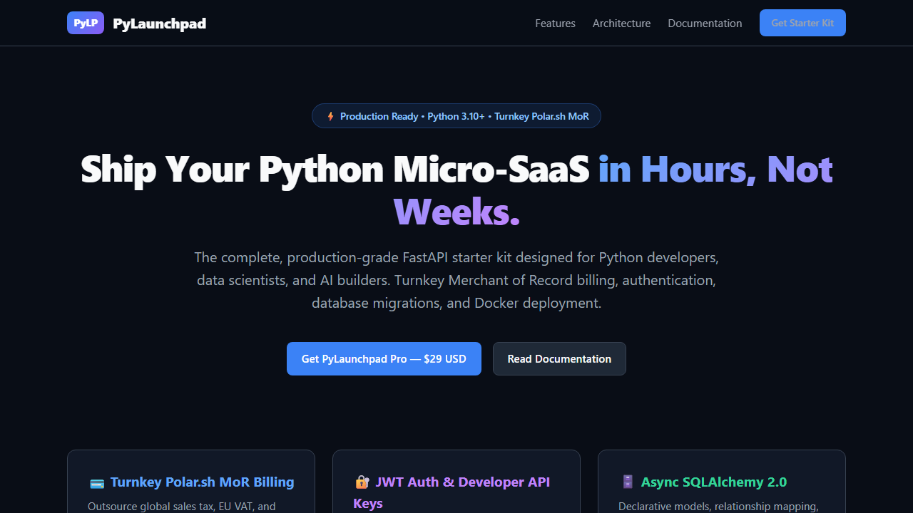

# PyLaunchpad

Production-grade FastAPI micro-SaaS and AI API starter kit with turnkey Polar.sh Merchant of Record billing.

[](https://www.python.org/)
[](https://fastapi.tiangolo.com/)
[](https://www.sqlalchemy.org/)
[](tests/)
[](https://polar.sh/)
[](https://lorthris.github.io/pylaunchpad/demo.html)
[](distribution/LICENSE)

<br/>

<p align="center">
  
</p>

---

## Purpose

PyLaunchpad is a production foundation for Python developers, data scientists, and engineers building micro-SaaS products and paid AI APIs. It removes weeks of configuration by integrating Merchant of Record billing, dual authentication (JWT and API keys), async database operations, a dark-mode dashboard, and automated Docker deployment.

---

## Core Capabilities

1. **Turnkey Polar.sh MoR Billing:** Polar.sh handles international sales tax, European Union VAT, and Australian GST. PyLaunchpad includes cryptographic webhook signature verification and automated entitlement provisioning.
2. **Dual Authentication:** Secure Bearer JWT tokens for browser dashboards and SHA-256 hashed API keys with rate limiting for developer programmatic access.
3. **Async SQLAlchemy 2.0:** Declarative database models with instant zero-setup SQLite for local development and PostgreSQL support for production.
4. **Asynchronous Background Task Queue:** Non-blocking in-process job worker with retries for handling emails and external AI API calls.
5. **Dark Mode Interface:** Responsive dashboard, login, and registration views with zero Node.js build dependencies and sub-50ms page load times.
6. **Production Containerisation:** Multi-stage Dockerfile and Docker Compose stack with Caddy reverse proxy for automated TLS certificates.
7. **AI Pair Programming Rulesets:** Pre-configured `CLAUDE.md`, `.cursorrules`, `AGENTS.md`, and Copilot instructions for immediate AI assistance.

---

## Architecture

```
pylaunchpad/
├── pylaunchpad/
│   ├── app.py              # Application factory, middleware, and route mounting
│   ├── config.py           # Pydantic v2 Settings configuration
│   ├── database.py         # SQLAlchemy engine and session dependency
│   ├── models/             # Database ORM models (User, Order, Subscription, APIKey)
│   ├── schemas/            # Pydantic validation models
│   ├── auth/               # Security, password hashing, JWT, and dependencies
│   ├── billing/            # Polar.sh API client and webhook verification
│   ├── marketing.py        # Marketing UTM tracking and automated SEO audit tooling
│   ├── tasks/              # In-process asynchronous task worker
│   ├── api/v1/             # Versioned REST API routes
│   ├── static/             # Dark-mode stylesheets and client controllers
│   └── templates/          # Jinja2 dashboard and landing views
├── docs/                   # Static showcase and documentation (GitHub Pages)
├── tests/                  # Automated test suite (25 unit and integration tests)
├── distribution/           # Release builder and commercial license
├── Dockerfile              # Minimal multi-stage production image
├── docker-compose.yml      # Complete stack with Caddy automatic TLS
└── pyproject.toml          # Standard packaging and dependencies
```

---

## Quickstart

### 1. Installation

```bash
# Clone repository
git clone https://github.com/lorthris/pylaunchpad.git
cd pylaunchpad

# Create and activate virtual environment
python -m venv venv
source venv/bin/activate  # On Windows: .\venv\Scripts\Activate.ps1

# Install package in editable mode
pip install -e .
```

### 2. Configuration & Initialization

Initialize your environment with a single command:

```bash
# Automated setup (generates cryptographic secrets & defaults)
python -m pylaunchpad.cli init --name "MyMicroSaaS"

# Or manually copy template
cp .env.example .env
```

### 3. Run Development Server

```bash
uvicorn pylaunchpad.app:app --reload --port 8000
```

- Landing Page: `http://localhost:8000`
- Interactive Swagger API: `http://localhost:8000/api/docs`
- Developer Dashboard: `http://localhost:8000/dashboard`

---

## Automated Testing

Run the automated test suite:

```bash
pytest -v tests/
```

Test coverage includes:
- JWT token lifecycle, expiry, and PBKDF2 password hashing.
- User registration, duplicate email rejection, and authentication.
- Polar.sh Standard Webhook HMAC-SHA256 signature verification.
- Webhook replay attack prevention (timestamp drift verification).
- Order provisioning and subscription lifecycle events.
- Developer API key creation, hashed validation, and revocation.
- Polar.sh License Key automated validation and entitlement verification.
- Search engine optimization compliance auditing and UTM tracking.
- Asynchronous task worker job execution.

---

## Commercial Licensing

PyLaunchpad Pro is available for purchase as a commercial developer licence with perpetual rights and free updates.

- **Purchase URL:** [https://buy.polar.sh/polar_cl_QR5Aikj1Q8exnjbQZfG2X4BdV7fqIgyeJEmxj1E2Wxk](https://buy.polar.sh/polar_cl_QR5Aikj1Q8exnjbQZfG2X4BdV7fqIgyeJEmxj1E2Wxk)
- **Launch Discount Code:** `LAUNCH20` (20% off)
- **Licence Terms:** See [`distribution/LICENSE`](distribution/LICENSE).
